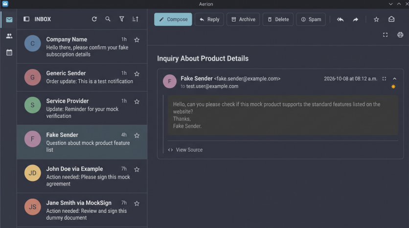

# Aerion Email Client (_Personal Fork_)

## Overview

- This is a personal fork of [Aerion](https://github.com/hkdb/aerion), a cross-platform email client by [hkdb](https://github.com/hkdb). 
- The goal of this project is to turn Aerion into a Beeper-like chat app for email.

**Notes:**

- This fork started as a simple UI customizaton for Aerion, but has diverged greatly since.
- This fork tracks upstream Aerion for now, but it is likely to diverge and may eventually stop tracking it.
- This fork will eventually be renamed and moved to a new Github repo.
- Expect these differences:
  - Upstream release binaries do not include these changes. Build from source to use this fork.
  - Only the English UI is maintained. Other languages may be incomplete or out of date.
  - Report problems with fork features here, not upstream.

## Features

- Threads show as chat bubbles, with quoted history and signatures hidden
- A docked reply box at the bottom of each conversation
- Keyboard triage: Done, pin, snooze, and mark unread
- A Low priority split that keeps newsletters and other bulk mail out of the main list
- Pin, snooze, and sender priority are stored on this computer and are not synced to the server

See [Email Management](docs/user-guide/features/email-management.md#chat-mail) for details.

## Installation

Build from source with the [Build Guide](docs/BUILD.md). The [Installation Guide](docs/user-guide/getting-started/installation/index.md) covers upstream's release binaries, which do not include this fork's changes.

## Documentation

- [User Guide](docs/user-guide/intro.md)

## Development

This application is built with [Wails](https://wails.io) and [Svelte](https://svelte.dev/).

### Contributing

Please see [CONTRIBUTING.md](CONTRIBUTING.md).
